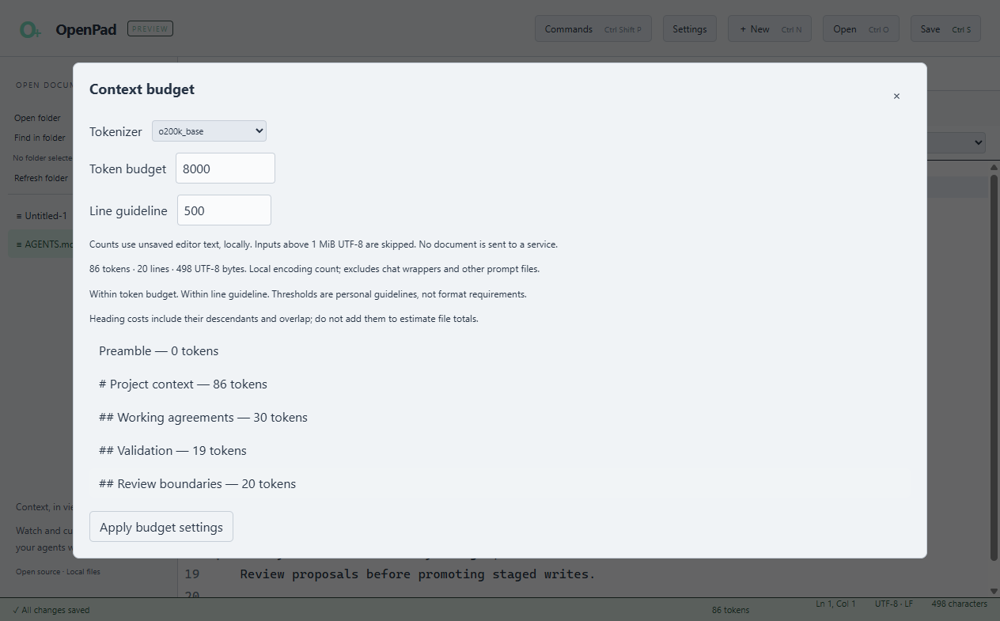
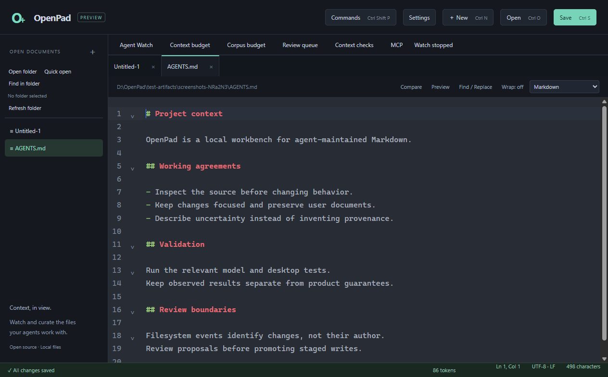
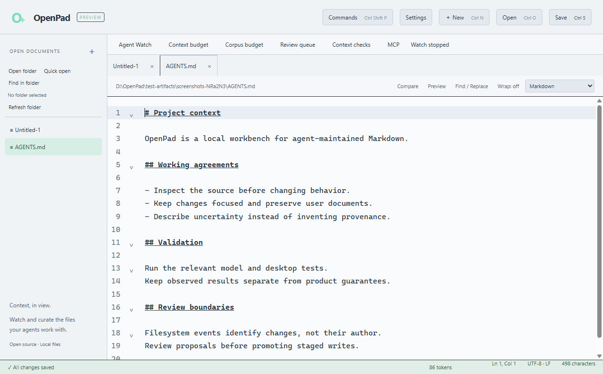

# OpenPad

**A local context workbench for Markdown maintained by people and AI agents.**

Watch files change, inspect observed diffs, measure context costs, and curate the instructions your agents use. OpenPad combines a desktop text editor with tools for working on `AGENTS.md`, `CLAUDE.md`, `MEMORY.md`, `SKILL.md`, and other project notes.



**Early preview · MIT licensed · Windows verified**

[Scope](SCOPE.md) · [Validation](VALIDATION.md) · [Roadmap](docs/ROADMAP.md) · [Contributing](CONTRIBUTING.md)

## What you can do

| Workflow | Available today |
| --- | --- |
| Watch agent activity | Event-driven folder monitoring, include/exclude filters, activity feed, session history, and read-only follow/tail for clean buffers. |
| Inspect changes | Opt-in retained before/after observations, a historical review queue, persisted acknowledgment decisions, and Markdown session reports. |
| Measure context | Local `o200k_base` and `cl100k_base` token counts, Markdown heading subtree costs, configurable budgets, and saved-file corpus rankings. |
| Improve context files | Advisory checks for length, empty sections, repeated prose, placeholders, and optional date reminders; seven editable starter templates. |
| Connect an agent | An opt-in authenticated localhost MCP server with seven editor-control and context tools. |
| Edit comfortably | Tabs, pins, groups, workspaces, independent panes, Markdown preview, folder search, comparison, bookmarks, macros, and explicit encoding/EOL handling. |

OpenPad observes filesystem changes; it cannot identify who wrote them. Historical review acknowledges changes already on disk. **Staged writes and approval before a file changes are planned.**

<details>
<summary>Editor appearance</summary>





</details>

## Run from source

Use **Windows x64, Node.js 26, npm, and Git**. Other platforms have not received runtime validation.

```powershell
git clone https://github.com/0xPliny/OpenPad.git
cd OpenPad
npm ci
npm start
```

Open a Markdown file and use the command palette (`Ctrl+Shift+P`) to find context, Watch, review, and template actions. Quick Open is `Ctrl+P`. Start Watch on a folder to establish the scope for corpus tools and optional MCP access.

This repository is a source preview. A signed installer, automatic updates, and package-manager distribution are not available yet. See [building and testing](docs/BUILDING.md) for local packaging.

## MCP integration

Start Watch, then explicitly enable MCP in OpenPad. The server uses an ephemeral `127.0.0.1` port and a fresh bearer token. Stopping Watch or disabling MCP revokes access; it never enables itself on restart.

Available tools: `open_file`, `reveal_range`, `set_status`, `count_tokens`, `lint_agent_file`, `get_context_budget`, and `get_session_provenance`.

Tools operate within the selected Watch scope and its exclusions. This version exposes no file-write or review-decision tools. It supports native HTTP clients with bearer authentication; browser origins are rejected. SDK interoperability is tested, but end-user Cursor and Claude Code configurations are not yet validated. Invocation metadata is bounded and kept in memory, without raw arguments, document contents, paths, or tokens. See [the full contract](SCOPE.md#current-limits).

## Current limits

- Windows is the only runtime-verified platform. Accessibility, screen-reader, high-contrast, and full DPI audits remain open.
- Files opened for editing are limited to 32 MiB. Larger files have bounded read-only UTF-8 utilities. Watch and context analysis have smaller, documented limits.
- Filesystem events can coalesce or be missed. Network drives and log rotation have no guarantees; watches do not resume automatically.
- Token counts exclude chat framing. Characters/4 is an explicitly labeled estimate, not exact Claude tokenization. Corpus totals measure saved files, not unsaved buffers or an atomic folder snapshot.
- Recovery can lose changes since the last completed snapshot. Undo does not survive restart, and power-loss durability is not certified.
- Save conflict checks can race external writers; multi-file replacement is not crash-atomic. OpenPad does not yet provide a locked staging/approval protocol.

OpenPad retains useful text-editor ergonomics but is not pursuing Notepad++ parity, an IDE, retrieval/embeddings, or Obsidian plugin compatibility. Detailed bounds and planned work are in [SCOPE.md](SCOPE.md).

## Development

```powershell
npm test
npm run test:ui
```

Tests cover models, failure injection, and isolated Electron desktop scenarios. Their limits and validation environment are recorded in [VALIDATION.md](VALIDATION.md). Contributions should preserve file bytes, unsaved edits, cancellation, and recovery behavior. Please use synthetic files in issues and pull requests; never include private notes, profiles, or credentials.

## License

[MIT](LICENSE). Single-user review and MCP are part of the open-source project. Third-party dependencies retain their own licenses. The package's `private: true` setting prevents accidental npm publication; it does not restrict use or contribution under the MIT license.
